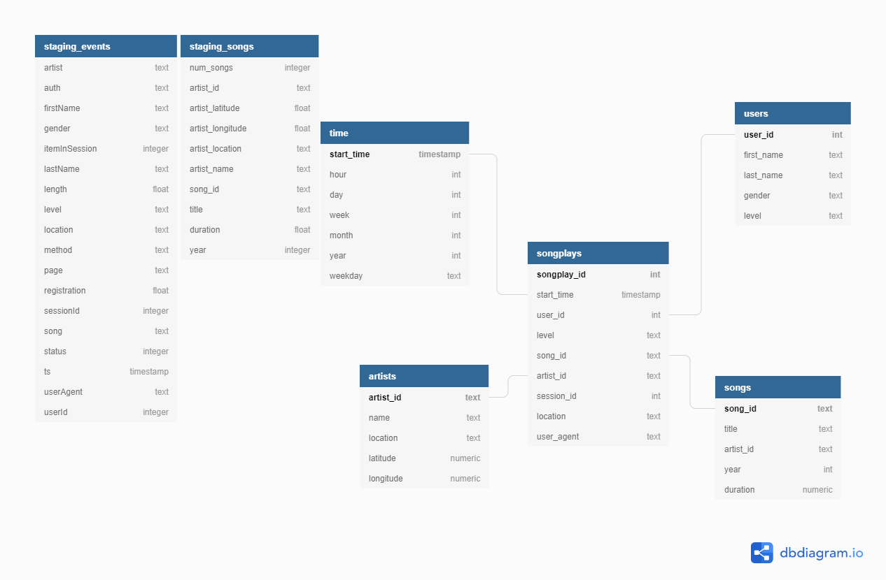

# Project: Data Warehouse
#### Introduction

A music streaming startup, Sparkify, has grown their user base and song database and want to move their processes and data onto the cloud. Their data resides in S3, in a directory of JSON logs on user activity on the app, as well as a directory with JSON metadata on the songs in their app.

As their data engineer, you are tasked with building an ETL pipeline that extracts their data from S3, stages them in Redshift, and transforms data into a set of dimensional tables for their analytics team to continue finding insights in what songs their users are listening to. You'll be able to test your database and ETL pipeline by running queries given to you by the analytics team from Sparkify and compare your results with their expected results.

#### Project Datasets
You'll be working with two datasets that reside in S3. Here are the S3 links for each:

Song data: s3://udacity-dend/song_data
Log data: s3://udacity-dend/log_data
Log data json path: s3://udacity-dend/log_json_path.json

#### Song Dataset
The first dataset is a subset of real data from the Million Song Dataset. Each file is in JSON format and contains metadata about a song and the artist of that song. The files are partitioned by the first three letters of each song's track ID. For example, here are filepaths to two files in this dataset.

- song_data/A/B/C/TRABCEI128F424C983.json
- song_data/A/A/B/TRAABJL12903CDCF1A.json

And below is an example of what a single song file, TRAABJL12903CDCF1A.json, looks like.

```json
{
    "num_songs": 1, 
    "artist_id": "ARJIE2Y1187B994AB7", 
    "artist_latitude": null, 
    "artist_longitude": null, 
    "artist_location": "", 
    "artist_name": "Line Renaud", 
    "song_id": "SOUPIRU12A6D4FA1E1", 
    "title": "Der Kleine Dompfaff", 
    "duration": 152.92036, "year": 0
}
```
#### Log Dataset
The second dataset consists of log files in JSON format generated by this event simulator based on the songs in the dataset above. These simulate app activity logs from an imaginary music streaming app based on configuration settings.

The log files in the dataset you'll be working with are partitioned by year and month. For example, here are filepaths to two files in this dataset.

- log_data/2018/11/2018-11-12-events.json
- log_data/2018/11/2018-11-13-events.json

#### Schema for Song Play Analysis
Using the song and event datasets, we have create a star schema optimized for queries on song play analysis. This includes the following tables.

#### Fact Table
- songplays - records in event data associated with song plays i.e. records with page NextSong (songplay_id, start_time, user_id, level, song_id, artist_id, session_id, location, user_agent)

#### Dimension Tables
- users - users in the app (user_id, first_name, last_name, gender, level)
- songs - songs in music database (song_id, title, artist_id, year, duration)
- artists - artists in music database (artist_id, name, location, lattitude, longitude)
- time - timestamps of records in songplays broken down into specific units (start_time, hour, day, week, month, year, weekday)

#### Staging Tables
- staging_events
- staging_songs



#### Project Template

- create_table.py is where you'll create your fact and dimension tables for the star schema in Redshift.
- etl.py is where you'll load data from S3 into staging tables on Redshift and then process that data into your analytics tables on Redshift.
- sql_queries.py is where you'll define you SQL statements, which will be imported into the two other files above.
- README.md is where you'll provide discussion on your process and decisions for this ETL pipeline.
- create_aws_cluster.py is where the redshift cluster will be created on AWS
- clean_aws_cluster.py is where the redshift cluster will be deleted
- tests.ipynb is a notebook to test the analytics and stagging tables
- dwh.cfg is the configuration file

#### Project Steps
Below are steps you can follow to complete each component of this project.

#### Create Table Schemas

- Design schemas for your fact and dimension tables
- Write a SQL CREATE statement for each of these tables in sql_queries.py
- Complete the logic in create_tables.py to connect to the database and create these tables
- Write SQL DROP statements to drop tables in the beginning of create_tables.py if the tables already exist. This way, you can run create_tables.py whenever you want to reset your database and test your ETL pipeline.
- Launch a redshift cluster and create an IAM role that has read access to S3.
- Add redshift database and IAM role info to dwh.cfg.
- Test by running create_tables.py and checking the table schemas in your redshift database. You can use Query Editor in the AWS Redshift console for this.
#### Build ETL Pipeline

- Implement the logic in etl.py to load data from S3 to staging tables on Redshift.
- Implement the logic in etl.py to load data from staging tables to analytics tables on Redshift.
- Test by running etl.py after running create_tables.py and running the analytic queries on your Redshift database to compare your results with the expected results.
- Delete your redshift cluster when finished.

#### ETL Process
In this process we need to do a data clean up. For this we have extract the relevant data from stagging tables and insert into our OLAP tables (analytics tables). 

In this step I have used:
 - DISTINCT  to filter duplicated data
 - Filtered all data where (user_id = NULL) to remove invalid data
 - Used (page = 'NextSong') to filter songplays and user inserts 

#### How to run
1. Configure dwh.cfg KEY and SECRET 

```
[AWS]
KEY=<>
SECRET=<>
```


2. Run create_aws.cluster.py. This will create redshift cluster and print two lines in the end.

```
print("DWH_ENDPOINT :: ", DWH_ENDPOINT)
print("DWH_ROLE_ARN :: ", DWH_ROLE_ARN)
```

Use this to fill on dwh.cfg

```
[CLUSTER]
HOST=<DWH_ENDPOINT>

[IAM_ROLE]
ARN='<DWH_ROLE_ARN>'
```

3. Run create_tables.py (This will create stagging and analytics tables).

4. Run etl.py (This will load data from S3 to stagging tables and them store it on our analytics tables).

5. Use test.ipynb to test.

6. Run clean_aws_cluster.py to delete the redshift cluster and delete iam role.
